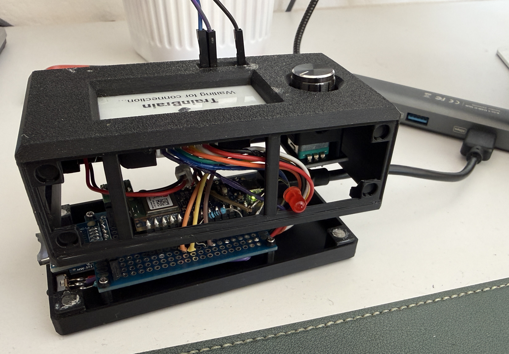

# TrainBrain

An iPhone app and a battery-powered e-ink device that work together over Bluetooth LE.
A rotary encoder on the device counts push-ups and pull-ups, or steps through a vocabulary quiz.

<!-- TODO: GIF of the device in action -->



**SwiftUI · CoreBluetooth · Swift Testing · Arduino Nano 33 BLE · ArduinoBLE · GxEPD2**

## What it does

| Mode | On the device | In the app |
|---|---|---|
| **Workout Counter** | Turn right: push-up +1 · turn left: pull-up +1 · press: reset | Live counts, session history |
| **Vocabulary Trainer** | Turn left: show translation and example sentence · turn right: next word · press: stop quiz | Add and edit words, dictionary with search, quiz |

The app also works without the device. The quiz then runs in the app only.

## Repository layout

```
ios/        Xcode project (iOS 18.4+)
firmware/   Arduino sketch for the display (TrainBrain.ino, icons.h)
```

## Hardware

A self-contained, battery-powered device in a 3D-printed case:

| Part | Details |
|---|---|
| Microcontroller | Arduino Nano 33 BLE |
| Display | 2.13" e-ink, 250 × 122 px (DEPG0213BN, SSD1680): CS 10, DC 8, RST 9, BUSY 7 |
| Input | Rotary encoder with push button: CLK 2, DT 3, SW 6 |
| Power | 500 mAh LiPo battery, USB-C charging, step-down converter to 3.3 V |
| Storage | microSD card module (not used by the firmware yet) |
| Indicator | Red LED that lights up while the e-ink panel refreshes |
| Case | 3D-printed, designed by me |

Everything is soldered on a perfboard that sits in the bottom of the case.

## Getting started

**Firmware**
1. Install the libraries **ArduinoBLE**, **GxEPD2** and **Adafruit GFX Library** in the Arduino IDE.
2. Open `firmware/TrainBrain/TrainBrain.ino`, select *Arduino Nano 33 BLE* and upload.
3. The device advertises as **TrainBrain**.

**App**
1. Open `ios/voc.xcodeproj` in Xcode and set your own development team.
2. Run it on an iPhone (Bluetooth doesn't work in the simulator).
3. Tap *Connect Device*, pick **TrainBrain**, then choose a mode.

## How the app talks to the display

One GATT service with seven characteristics:

| UUID suffix | Direction | Content |
|---|---|---|
| `…0001`–`…0003` | App → device | Lines 1–3: word, translation, example sentence (UTF-8) |
| `…0004` | App → device | Refresh region |
| `…0005` | Device → app | Rotary turn: `1` right, `2` left |
| `…0006` | Device → app | Knob pressed |
| `…0007` | App → device | Mode: `0` workout, `1` vocabulary, `255` welcome screen |

The app sends commands one at a time and waits for the device to confirm each write
before sending the next. Lines that haven't changed are skipped, because the firmware
redraws the e-ink panel on every write.

## App architecture

- `BLEManager`: connection lifecycle (timeouts, retries, reconnecting), command queue and the protocol above
- `AppState`: the selected mode; sends knob input to the active feature
- `WorkoutManager` / `VocabularyManager`: the feature logic, saved in `UserDefaults`
- Views get the managers through the SwiftUI environment (`@Observable`)

The feature logic is covered by unit tests (Swift Testing) that use a fake display.

## Known limitations

- In workout mode the firmware keeps its own counters. Changes made with the app's +/– buttons don't show on the display.
- The display fonts are 7-bit ASCII, so umlauts (ä, ö, ü, ß) don't render.
- After a reconnect, the display shows its welcome screen until a mode is selected again.

## Ideas

- Storing the vocabulary on the microSD card so the quiz also works without the phone
- Showing the battery level in the app and on the display
- Counting pull-ups automatically with a distance sensor (early experiments done)
- A desk vocabulary buddy that reveals words through eye tracking and gestures
